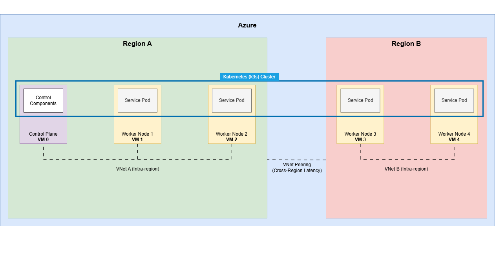
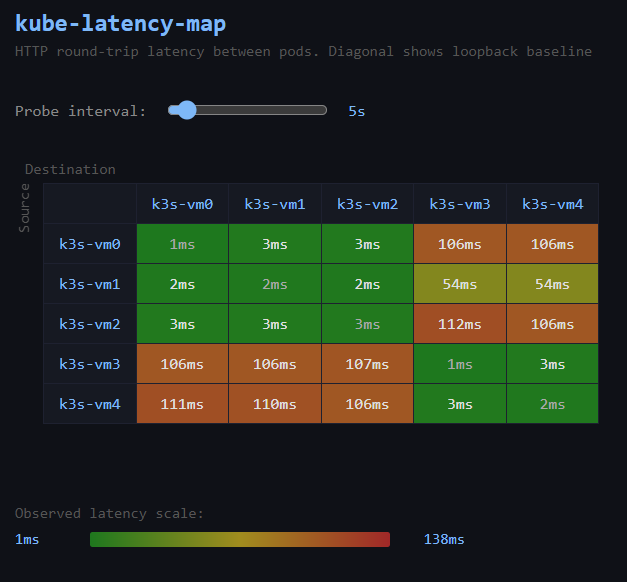

# k3s-multiregion-azure
### Multi-Region Kubernetes Cluster on Azure as a Testbed for RL-Driven Microservice Scheduling

This project builds a self-managed Kubernetes cluster spanning two Azure regions as a controlled environment for experimenting with topology-aware microservice scheduling. The long-term goal is to develop a machine learning-based scheduler that predicts which microservices communicate frequently and places them physically closer together to reduce accumulated network latency.

---

# Table of Contents

1. [Overview](#1-overview)
   - [1.1 Project Goals](#11-project-goals)
   - [1.2 Non-Goals](#12-non-goals)
   - [1.3 Future Work](#13-future-work)

2. [Tooling](#2-tooling)

3. [Architecture](#3-architecture)
   - [3.1 Cluster Design](#31-cluster-design)
   - [3.2 Why Self-Managed k3s Instead of AKS](#32-why-self-managed-k3s-instead-of-aks)
   - [3.3 Region Selection and Latency](#33-region-selection-and-latency)

4. [Running It](#4-running-it)
   - [4.1 Prerequisites](#41-prerequisites)
   - [4.2 Configuration](#42-configuration)
   - [4.3 Provisioning](#43-provisioning)
   - [4.4 Cluster Setup and Application Deployment](#44-cluster-setup-and-application-deployment)
   - [4.5 Teardown](#45-teardown)

5. [Development: Infrastructure](#5-development-infrastructure)
   - [5.1 Repository Structure](#51-repository-structure)
   - [5.2 Variable Design](#52-variable-design)
   - [5.3 Networking](#53-networking)
   - [5.4 Virtual Machines](#54-virtual-machines)
   - [5.5 Outputs](#55-outputs)
   - [5.6 Baseline Latency Measurements](#56-baseline-latency-measurements)

6. [Development: Cluster](#6-development-cluster)
   - [6.1 Ansible Directory Structure](#61-ansible-directory-structure)
   - [6.2 Inventory Generation](#62-inventory-generation)
   - [6.3 Control Plane Installation](#63-control-plane-installation)
   - [6.4 Worker Node Installation](#64-worker-node-installation)
   - [6.5 Cluster Validation](#65-cluster-validation)

7. [Development: Application Deployment](#7-development-application-deployment)
   - [7.1 Ansible Directory Structure](#71-ansible-directory-structure)
   - [7.2 Application Overview](#72-application-overview)
   - [7.3 Deployment](#73-deployment)
   - [7.4 Validation](#74-validation)

---

# 1. Overview

Modern cloud applications consist of many constantly communicating microservices. When two services exchange frequent communication, they are described as *chatty*. The physical placement of chatty services has significant performance implications. If they are placed far apart, network latency accumulates across every internal call, degrading system responsiveness.

This project builds the infrastructure foundation for a future RL-driven Kubernetes scheduler that predicts which microservices are chatty and co-locates them to minimize latency. The cluster spans two Azure regions, where each region acts as a proxy for a rack in a datacenter: nodes within a region are treated as "close," while nodes across regions are "far," introducing measurable latency differences.

### What It Does

1. Provisions 5 virtual machines across two Azure regions using OpenTofu
2. Connects the regions via VNet peering for private IP communication
3. Installs k3s across all nodes to form a single multi-region Kubernetes cluster
4. Deploys a containerized [latency visualization application](https://github.com/eb613819/kube-latency-map) to validate cross-region scheduling

### Research Question

> Can a multi-region Kubernetes cluster provide a sufficiently controlled latency environment to serve as a testbed for RL-driven microservice scheduling experiments?

## 1.1 Project Goals

- Provision a multi-region Azure VM cluster using infrastructure-as-code
- Connect the two regions via VNet peering so nodes communicate over private IPs
- Demonstrate measurable, consistent latency differences between intra-region and inter-region communication
- Install k3s across all nodes to form a single unified cluster spanning both regions
- Deploy a latency visualization application and verify that pods are scheduled across nodes in both regions
- Verify the cluster operates reliably as a unified system and the application is externally accessible

## 1.2 Non-Goals

- This project does not implement the RL scheduler itself
- No managed Kubernetes service (AKS) is used

## 1.3 Future Work

- Develop and integrate a custom RL-based scheduler that replaces `kube-scheduler`
- Use placement decisions and measured latency to train and evaluate scheduling models

---

# 2. Tooling

**OpenTofu** is used to provision all infrastructure:
- Virtual machines across two Azure regions
- Virtual networks and subnets per region
- VNet peering between regions
- Network security groups
- Public and private IP allocation

**Ansible** is used to configure the cluster after provisioning:
- Install k3s server on the control plane node
- Join worker nodes across both regions to the cluster
- Deploy [kube-latency-map](https://github.com/eb613819/kube-latency-map) to validate scheduling and measure/visualize latency

**k3s** is the chosen Kubernetes distribution. It is lightweight and exposes the control plane components, allowing future replacement of `kube-scheduler` with a custom RL-based implementation. It also allows all nodes across both regions to participate in a single cluster without the federation complexity that multi-region AKS deployments require.

---

# 3. Architecture

## 3.1 Cluster Design

The cluster consists of 5 nodes distributed across two Azure regions:

| Node | Region | Role |
|------|--------|------|
| vm0 | northcentralus | Control Plane |
| vm1 | northcentralus | Worker |
| vm2 | northcentralus | Worker |
| vm3 | mexicocentral | Worker |
| vm4 | mexicocentral | Worker |

The control plane runs in Region A (`northcentralus`). Worker nodes are distributed across both regions. All nodes participate in a single k3s cluster connected via Azure VNet peering.



## 3.2 Why Self-Managed k3s Instead of AKS

Azure Kubernetes Service (AKS) abstracts away control plane components including `kube-scheduler`. Because this component cannot be easily replaced or modified in AKS, it is not suitable for experimentation with custom scheduling algorithms.

A self-managed k3s cluster deployed on Azure VMs provides full control over the control plane, allowing future integration of a custom RL-based scheduler. Additionally, this approach allows all nodes across both regions to participate in a single cluster without the federation complexity that multi-region AKS deployments require.

## 3.3 Region Selection and Latency

Regions were selected based on subscription availability and geographic distance. `northcentralus` (Chicago) and `mexicocentral` (Querétaro) provide meaningful physical separation while remaining within the same subscription quota.

Baseline ping measurements and final HTTP rtt measurements confirmed the expected topology.
- Baseline ping measurements from [5.6](#56-baseline-latency-measurements):
   | Source | Destination | Region Relationship | Avg RTT |
   |--------|-------------|---------------------|---------|
   | vm0 (northcentralus) | vm1 (northcentralus) | Intra-region | < 1ms |
   | vm3 (mexicocentral) | vm4 (mexicocentral) | Intra-region | < 1ms |
   | vm0 (northcentralus) | vm3 (mexicocentral) | Cross-region | ~52ms |
   | vm0 (northcentralus) | vm4 (mexicocentral) | Cross-region | ~52ms |
   | vm3 (mexicocentral) | vm0 (northcentralus) | Cross-region | ~52ms |
- HTTP latency measurements from [7.4](#74-validation):
   | | k3s-vm0 | k3s-vm1 | k3s-vm2 | k3s-vm3 | k3s-vm4 |
   |---|---|---|---|---|---|
   | **k3s-vm0** | 1ms | 3ms | 3ms | 106ms | 106ms |
   | **k3s-vm1** | 2ms | 2ms | 2ms | 54ms | 54ms |
   | **k3s-vm2** | 3ms | 3ms | 3ms | 112ms | 106ms |
   | **k3s-vm3** | 106ms | 106ms | 107ms | 1ms | 3ms |
   | **k3s-vm4** | 111ms | 110ms | 106ms | 3ms | 2ms |

---

# 4. Running It

## 4.1 Prerequisites

- [OpenTofu](https://opentofu.org/docs/) installed
- [Azure CLI](https://learn.microsoft.com/en-us/cli/azure/install-azure-cli) installed and logged in
- [Ansible](https://docs.ansible.com/) installed
- An SSH RSA key pair (Azure requires RSA; ed25519 is not supported for all VM series)

### Install OpenTofu
1.) Download the installer script:
  ```bash
  curl -fsSL https://get.opentofu.org/install-opentofu.sh -o install-opentofu.sh
  ```
2.) Grant execute permissions and review the script:
  ```bash
  chmod +x install-opentofu.sh && less install-opentofu.sh
  ```
3.) Install using the script:
  ```bash
  ./install-opentofu.sh --install-method standalone
  ```
4.) Check that OpenTofu is installed:
  ```bash
  tofu version
  ```
  ```console
  OpenTofu v1.11.4
  on linux_amd64
  ```
5.) Remove the installer:
  ```bash
  rm -f install-opentofu.sh
  ```
6.) To set up auto-completion, run the following:
```bash
tofu -install-autocomplete
```

### Install Azure CLI
1.) Install Azure CLI
```bash
curl -sL https://aka.ms/InstallAzureCLIDeb | sudo bash
```
2.) Authenticate with:
```bash
az login
```
3.) If you have access to multiple subscriptions, ensure the correct one is selected:
```bash
az account set --subscription 00000000-0000-0000-0000-000000000000
```
You can confirm the active subscription again with:
```bash
az account show
```

### Install Ansible
```bash
sudo add-apt-repository --yes --update ppa:ansible/ansible
sudo apt update
sudo apt install -y ansible software-properties-common python-is-python3 python3-pip python3-tabulate python3-lxml

pip install pydantic==1.9 --break-system-packages
```

### Generate an SSH Key
1.) Generate the key
```bash
ssh-keygen -t rsa -b 4096 -f ~/.ssh/k3s_azure -C "k3s-cluster"
```

2.) Get the public key and paste into `terraform.tfvars`:
```bash
cat ~/.ssh/k3s_azure.pub
```

## 4.2 Configuration
### Subscription ID
Copy the example secrets file and fill in your subscription ID:
```bash
cp secrets.auto.tfvars.example secrets.auto.tfvars
```
`secrets.auto.tfvars` is gitignored.
Your subscription ID can be found with:
```bash
az account show --query id -o tsv
```

### Infrastructure
`terraform.tfvars` is committed to the repository and contains all non-sensitive configuration. Edit it if you need to change regions, VM size, or image:

```hcl
region_a       = "northcentralus"
region_b       = "mexicocentral"
prefix         = "k3s"
admin_username = "ubuntu"
ssh_pub_key    = "ssh-rsa AAAA..."
vm_size        = "Standard_B2ats_v2"
image = {
  publisher = "Canonical"
  offer     = "ubuntu-24_04-lts"
  sku       = "server"
  version   = "latest"
}
```

### Ansible SSH
Update `ansible/ansible.cfg` with the path to your SSH private key:

```ini
[ssh_connection]
private_key_file = ~/.ssh/k3s_azure
```

## 4.3 Provisioning

```bash
tofu init
tofu plan
tofu apply
```

After apply completes, OpenTofu outputs all IP addresses:

```bash
tofu output vm_public_ips
tofu output vm_private_ips
tofu output control_plane_private_ip
```

To SSH into a node:
```bash
ssh -i ~/.ssh/k3s_azure ubuntu@<public-ip>
```

## 4.4 Cluster Setup and Application Deployment
Run the Ansible playbook from the `ansible/` directory to install k3s and deploy the application:

```bash
cd ansible
ansible-playbook playbooks/cluster.yml
```

Once complete, the playbook prints the URL of the latency visualization UI:
```
ok: [vm0] => {
"msg": "kube-latency-map is available at http://<control-plane-public-ip>:30080"
}
```
**Note**: The output URL is for the control plane, but any vm can serve the latency visualization UI.

## 4.5 Teardown
from the root of the repo:
```bash
tofu destroy
```

Note: public IPs are dynamically assigned and will change after each destroy and re-apply.

---

# 5. Development: Infrastructure

## 5.1 Repository Structure

```
k3s-multiregion-azure/
├── providers.tf                # Provider
├── locals.tf                   # Locals
├── main.tf                     # Resource group, VNets, peering, NSGs
├── variables.tf                # All variable declarations
├── vms.tf                      # Public IPs, NICs, NSG associations, VMs
├── outputs.tf                  # Public IPs, private IPs, control plane IP
├── inventory.tf                # Generates an Ansible inventory
├── terraform.tfvars            # Non-sensitive configuration values
├── secrets.auto.tfvars         # gitignored — subscription ID
├── secrets.auto.tfvars.example # Committed template for secrets file
├── .gitignore
```

## 5.2 Variable Design

Variables are split across two files:

- `terraform.tfvars` — all non-sensitive configuration, committed to version control
- `secrets.auto.tfvars` — subscription ID only, gitignored

Region variables (`region_a`, `region_b`) are defined as top-level variables. The node map is defined as a `local` rather than a variable so that node-to-region assignments are expressed in terms of `var.region_a` and `var.region_b` directly, avoiding the HCL limitation that prevents variable references inside `tfvars` values:

```hcl
locals {
  nodes = {
    vm0 = { region = var.region_a, role = "control" }
    vm1 = { region = var.region_a, role = "worker"  }
    vm2 = { region = var.region_a, role = "worker"  }
    vm3 = { region = var.region_b, role = "worker"  }
    vm4 = { region = var.region_b, role = "worker"  }
  }
}
```

This ensures that changing `region_a` or `region_b` in `tfvars` automatically flows through to all node assignments with no risk of them getting out of sync.

The `role` tag on each node has no meaning to OpenTofu. It is carried through as an Azure resource tag and will be used by Ansible to distinguish the control plane node from workers during k3s installation.

## 5.3 Networking

Each region has its own VNet with a non-overlapping address space:

| | VNet CIDR | Subnet |
|-|-----------|--------|
| Region A | 10.0.0.0/16 | 10.0.1.0/24 |
| Region B | 10.1.0.0/16 | 10.1.1.0/24 |

Non-overlapping ranges are required because once the VNets are peered, Azure routes traffic between them. Overlapping CIDRs would make routing ambiguous and cause the peering to fail.

VNet peering is configured bidirectionally — a peering from A to B and a separate peering from B to A. This allows all nodes to communicate over private IPs using Azure’s backbone network rather than the public internet.

This design is important for three reasons:

- k3s requires worker nodes to reach the control plane’s private IP when joining the cluster  
- Kubernetes workloads can communicate across regions as if they were on the same private network  
- Cross-region latency reflects physical datacenter distance rather than internet routing variability  

To support multi-node Kubernetes networking, peering is configured with forwarded traffic enabled, ensuring that VXLAN-encapsulated pod traffic is allowed between VNets.

Each region has its own Network Security Group. Instead of exposing services broadly or relying on public IP ranges, all NSG rules restrict traffic to the Azure `VirtualNetwork` source tag. This ensures that only traffic originating from within the peered VNets is allowed.

The following inbound ports are explicitly allowed:

- **22/TCP** — SSH access for node administration  
- **6443/TCP** — Kubernetes API server (k3s control plane)  
- **8472/UDP** — Flannel VXLAN overlay network for pod-to-pod communication across nodes  
- **10250/TCP** — Kubelet API used for node management, logs, and exec operations  

## 5.4 Virtual Machines

VMs are created using `for_each` over two locals that split the node map by region:

```hcl
locals {
  nodes_a = { for k, v in local.nodes : k => v if v.region == var.region_a }
  nodes_b = { for k, v in local.nodes : k => v if v.region == var.region_b }
}
```

This drives two separate VM resource blocks, each creating only the nodes assigned to that region. Adding a node requires only adding an entry to the `nodes` local.

### VM Size

Getting a VM size that would actually provision took several attempts. `Standard_B2pts_v2` (ARM64) was the first choice but was unavailable in every region tried. `Standard_B2ats_v2` (AMD64) showed no capacity restrictions via `az vm list-skus` but still failed with a capacity error in both `eastus2` and `westus3`. Azure checks SKU availability and physical capacity independently — a SKU can appear unrestricted while having no actual capacity. `northcentralus` and `mexicocentral` were selected after confirming provisioning actually succeeded there.

Switching to AMD64 also required updating the image SKU from `server-arm64` to `server`.

**Note**: The size of the control plane VM is updated to `Standard_B2als_v2` in [section 6.3](#63-control-plane-installation).

### SSH Key

Azure rejected ed25519 keys for `Standard_B2ats_v2` in these regions despite the same key working on the same VM series in a previous project. RSA (4096-bit) is required.

### Provider Version

Upgrading from `azurerm ~> 3.0` to `~> 4.0` introduced a breaking change: `subscription_id` must now be explicitly declared in the provider block. This is kept out of version control in `secrets.auto.tfvars`.

### Inconsistent Apply Failures

Early apply runs produced `Provider produced inconsistent result after apply` errors on networking resources. These appeared to be caused by Azure failing mid-apply during the capacity error runs, leaving the provider state inconsistent. The fix was to delete the resource group directly via the Azure CLI and remove the state file before re-applying.

## 5.5 Outputs

Three outputs are defined:

- `vm_public_ips` — all node names to public IPs, used for SSH access
- `vm_private_ips` — all node names to private IPs
- `control_plane_private_ip` — private IP of vm0, used by Ansible when constructing the k3s agent join command for Region B workers

These outputs also drive automatic Ansible inventory generation via a `local_file` resource in `inventory.tf`. This ensures the inventory always reflects the current infrastructure state and no manual IP copying is needed between provisioning and cluster setup.

## 5.6 Baseline Latency Measurements

After provisioning, ping was used to measure round-trip latency between nodes. All measurements were taken over private IPs via the VNet peering link.

| Source | Destination | Region Relationship | Avg RTT |
|--------|-------------|---------------------|---------|
| vm0 (northcentralus) | vm1 (northcentralus) | Intra-region | < 1ms |
| vm3 (mexicocentral) | vm4 (mexicocentral) | Intra-region | < 1ms |
| vm0 (northcentralus) | vm3 (mexicocentral) | Cross-region | ~52ms |
| vm0 (northcentralus) | vm4 (mexicocentral) | Cross-region | ~52ms |
| vm3 (mexicocentral) | vm0 (northcentralus) | Cross-region | ~52ms |

The ~52x latency difference between intra-region and cross-region communication confirms that the infrastructure provides a meaningful and measurable topology signal. This is the core property the cluster needs to support future scheduling experiments.

---

# 6. Development: Cluster

This phase installs k3s across all five nodes using Ansible, forming a single multi-region Kubernetes cluster. The output is a running cluster with all nodes joined and verified.

## 6.1 Ansible Directory Structure
```bash
ansible/
├── ansible.cfg
├── inventory.yml              # opentofu-generated
├── group_vars/
│   └── all.yml
├── playbooks/
│   └── cluster.yml
└── roles/
    ├── k3s_control_plane/
    │   └── tasks/
    │       └── main.yml
    └── k3s_worker/
        └── tasks/
            └── main.yml
```

## 6.2 Inventory Generation
The inventory is generated by OpenTofu in `inventory.tf` using a `local_file` resource that writes `ansible/inventory.yml` on every `tofu apply`. Each host entry includes its public IP for SSH access, private IP for intra-cluster communication, and the SSH user and Python interpreter Ansible needs:
```hcl
resource "local_file" "ansible_inventory" {
  filename = "${path.module}/ansible/inventory.yml"

  content = yamlencode({
    all = {
      children = {
        control_plane = {
          hosts = {
            for k, v in local.nodes :
            k => {
              ansible_host = (
                v.region == var.region_a ?
                azurerm_public_ip.pip_a[k].ip_address :
                azurerm_public_ip.pip_b[k].ip_address
              )

              private_ip = (
                v.region == var.region_a ?
                azurerm_network_interface.nic_a[k].private_ip_address :
                azurerm_network_interface.nic_b[k].private_ip_address
              )

              ansible_user               = var.admin_username
              ansible_python_interpreter = "/usr/bin/python3"
            } if v.role == "control"
          }
        }

        workers = {
          hosts = {
            for k, v in local.nodes :
            k => {
              ansible_host = (
                v.region == var.region_a ?
                azurerm_public_ip.pip_a[k].ip_address :
                azurerm_public_ip.pip_b[k].ip_address
              )

              private_ip = (
                v.region == var.region_a ?
                azurerm_network_interface.nic_a[k].private_ip_address :
                azurerm_network_interface.nic_b[k].private_ip_address
              )

              ansible_user               = var.admin_username
              ansible_python_interpreter = "/usr/bin/python3"
            } if v.role == "worker"
          }
        }

        k3s_cluster = {
          children = {
            control_plane = {}
            workers       = {}
          }
        }
      }
    }
  })
}
```
The generated file looks like this (IPs change on every destroy/apply):
```yml
"all":
  "children":
    "control_plane":
      "hosts":
        "vm0":
          "ansible_host": "20.98.57.114"
          "ansible_python_interpreter": "/usr/bin/python3"
          "ansible_user": "ubuntu"
          "private_ip": "10.0.1.4"
    "k3s_cluster":
      "children":
        "control_plane": {}
        "workers": {}
    "workers":
      "hosts":
        "vm1":
          "ansible_host": "52.162.33.7"
          "ansible_python_interpreter": "/usr/bin/python3"
          "ansible_user": "ubuntu"
          "private_ip": "10.0.1.6"
        "vm2":
          "ansible_host": "135.232.254.30"
          "ansible_python_interpreter": "/usr/bin/python3"
          "ansible_user": "ubuntu"
          "private_ip": "10.0.1.5"
        "vm3":
          "ansible_host": "158.23.177.25"
          "ansible_python_interpreter": "/usr/bin/python3"
          "ansible_user": "ubuntu"
          "private_ip": "10.1.1.4"
        "vm4":
          "ansible_host": "158.23.177.45"
          "ansible_python_interpreter": "/usr/bin/python3"
          "ansible_user": "ubuntu"
          "private_ip": "10.1.1.5"
```

## 6.3 Control Plane Installation
The control plane role installs the k3s server, waits for the node token to be written, reads and stores the token as a fact for workers to use, then verifies the cluster is ready.

The readiness check went through a couple of iterations. The initial approach polled the API health endpoint:

```bash
curl -k https://127.0.0.1:6443/healthz
```

This caused the playbook to hang. Two things were wrong: the control plane VM (`Standard_B2ats_v2`) was under-resourced and initializing slowly, and the check was looking for `"ok"` in the response body. After upgrading the control plane to `Standard_B2als_v2` the API started responding, but returned a 401:

```json
{ "message": "Unauthorized", "code": 401 }
```

The API was running, but the check was wrong. Rather than trying to parse HTTP responses, the readiness check was replaced with:

```bash
k3s kubectl get nodes
```

This succeeds only when the API server is up, authentication is working, and the control plane is fully initialized.

## 6.4 Worker Node Installation
Each worker joins the cluster using the k3s agent installation script with `K3S_URL` set to the control plane's private IP and `K3S_TOKEN` read dynamically from the control plane host vars.

Early runs appeared to hang during worker installation. The initial assumption was a networking or token propagation issue, but the real cause was simpler: workers were trying to join before the control plane was fully ready. Once the control plane readiness check was fixed in [6.3](#63-control-plane-installation), workers joined cleanly without any changes to the worker role itself.

## 6.5 Cluster Validation
Cluster state was verified directly from the control plane using:
```bash
sudo k3s kubectl get nodes -o wide
```
```console
NAME      STATUS   ROLES                  AGE     VERSION        INTERNAL-IP   EXTERNAL-IP   OS-IMAGE             KERNEL-VERSION      CONTAINER-RUNTIME
k3s-vm2   Ready    <none>                 2m42s   v1.30.0+k3s1   10.0.1.5      <none>        Ubuntu 24.04.4 LTS   6.17.0-1011-azure   containerd://1.7.15-k3s1
k3s-vm1   Ready    <none>                 2m42s   v1.30.0+k3s1   10.0.1.6      <none>        Ubuntu 24.04.4 LTS   6.17.0-1011-azure   containerd://1.7.15-k3s1
k3s-vm4   Ready    <none>                 2m38s   v1.30.0+k3s1   10.1.1.5      <none>        Ubuntu 24.04.4 LTS   6.17.0-1011-azure   containerd://1.7.15-k3s1
k3s-vm3   Ready    <none>                 2m38s   v1.30.0+k3s1   10.1.1.4      <none>        Ubuntu 24.04.4 LTS   6.17.0-1011-azure   containerd://1.7.15-k3s1
k3s-vm0   Ready    control-plane,master   3m      v1.30.0+k3s1   10.0.1.4      <none>        Ubuntu 24.04.4 LTS   6.17.0-1011-azure   containerd://1.7.15-k3s1
```

All five nodes joined and all reported Ready, with internal IPs from both regions (`10.0.1.x` and `10.1.1.x`) confirming cross-region connectivity over private IPs.

To further validate scheduling across regions, a five-replica nginx deployment was run:
```bash
sudo k3s kubectl create deployment nginx --image=nginx --replicas=5
sudo k3s kubectl get pods -o wide
```
```console
NAME                    READY   STATUS    RESTARTS   AGE   IP          NODE      NOMINATED NODE   READINESS GATES
nginx-bf5d5cf98-dz9hs   1/1     Running   0          21s   10.42.0.8   k3s-vm0   <none>           <none>
nginx-bf5d5cf98-bgxwf   1/1     Running   0          21s   10.42.2.3   k3s-vm1   <none>           <none>
nginx-bf5d5cf98-cjgqt   1/1     Running   0          21s   10.42.3.3   k3s-vm4   <none>           <none>
nginx-bf5d5cf98-8rfjg   1/1     Running   0          21s   10.42.1.4   k3s-vm2   <none>           <none>
nginx-bf5d5cf98-pxchp   1/1     Running   0          21s   10.42.4.3   k3s-vm3   <none>           <none>
```
Pods were distributed across all five nodes including both Mexico Central workers, confirming the overlay network was functioning across regions and the scheduler was placing workloads cluster-wide.

---

# 7. Development: Application Deployment
 
This phase deploys a containerized latency visualization application to the cluster using Ansible. The output is a live web UI showing HTTP round-trip latency between all pods, confirming that the cluster's topology produces measurable and consistent latency differences at the application layer.
 
## 7.1 Ansible Directory Structure
 
```
ansible/
├── ansible.cfg
├── inventory.yml
├── group_vars/
│   └── all.yml
├── playbooks/
│   └── cluster.yml
└── roles/
    ├── k3s_control_plane/
    │   └── tasks/
    │       └── main.yml
    ├── k3s_worker/
    │   └── tasks/
    │       └── main.yml
    └── k3s_app/
        ├── files/
        │   ├── serviceaccount.yaml
        │   ├── rbac.yaml
        │   └── daemonset.yaml
        └── tasks/
            └── main.yml
```
 
The application manifests are stored in `roles/k3s_app/files/` rather than cloned from the application repo at deploy time.
 
## 7.2 Application Overview
 
[kube-latency-map](https://github.com/eb613819/kube-latency-map) is a standalone Kubernetes latency visualization tool. It deploys one pod per node via a DaemonSet, measures HTTP round-trip latency between all pods, and displays the results as a live updating matrix in a web UI. Each pod probes all other pods on a configurable interval and exposes its measurements via a REST API. Any pod can serve the dashboard by aggregating measurements from all peers on demand and rendering the full matrix.
 
The application is deployed from a published DockerHub image independent of this project. Full documentation is in its own repository.
 
## 7.3 Deployment
 
The application is deployed by the `k3s_app` role, which copies the three Kubernetes manifests to the control plane and applies them in order:
 
1. `serviceaccount.yaml` — creates a dedicated identity for the pods
2. `rbac.yaml` — grants that identity read-only permission to list pods in the namespace, used for peer discovery
3. `daemonset.yaml` — schedules one pod per node and exposes the UI on port 30080 via a NodePort service
The role waits until all pods are running before completing, then prints the URL of the UI:
 
```
ok: [vm0] => {
    "msg": "kube-latency-map is available at http://52.162.202.124:30080"
}
```
 
## 7.4 Validation
 
The UI displays a 5x5 latency matrix: one row and one column per node. The diagonal shows each node's loopback RTT, which represents a rough HTTP overhead baseline on that node.
 

 
| | k3s-vm0 | k3s-vm1 | k3s-vm2 | k3s-vm3 | k3s-vm4 |
|---|---|---|---|---|---|
| **k3s-vm0** | 1ms | 3ms | 3ms | 106ms | 106ms |
| **k3s-vm1** | 2ms | 2ms | 2ms | 54ms | 54ms |
| **k3s-vm2** | 3ms | 3ms | 3ms | 112ms | 106ms |
| **k3s-vm3** | 106ms | 106ms | 107ms | 1ms | 3ms |
| **k3s-vm4** | 111ms | 110ms | 106ms | 3ms | 2ms |
 
The results confirm the expected topology at the application layer:
 
- **Intra-region HTTP RTT is 2–3ms**, compared to <1ms from the ping measurements in [section 5.6](#56-baseline-latency-measurements). The difference is consistent with HTTP overhead.
- **Cross-region HTTP RTT is 54–112ms**, compared to ~52ms from ping —can get as high as roughly 2x, also consistent with HTTP overhead on top of the underlying network latency.
- **Loopback RTT is 1-3ms** on all nodes, confirming that HTTP overhead is consistent across the cluster and does not vary meaningfully by node.
One notable observation is that the matrix is not perfectly symmetric. This likely reflects differences in processing load or network path at the time of measurement rather than a true directional latency difference.
 
The difference between intra-region and cross-region latency observed in the ping measurements is preserved at the application layer, confirming that the cluster provides a sufficiently controlled and measurable topology signal to serve as a testbed for RL-driven microservice scheduling experiments.
